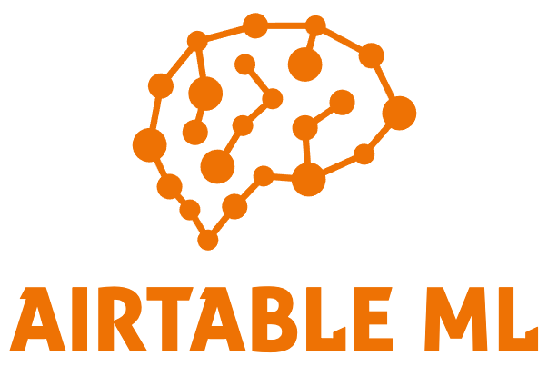

#### An open source, neural network-based Airtable Block for performing automatic prediction & classification.

* Automates record prioritization, sales predictions, user assignment, classification, numerical regression, and much more. 
* Given a set of Airtable fields, predict: numbers, categories, dates, currency values, and more.
* Learns from correct examples to predict new examples.
* Runs entirely in your browser: no data is shared with any service outside of Airtable.
* [GPU accelerated](https://gpu.rocks/#/)!
* Free and open source.

## Usage

Using Airtable ML for prediction or regression is easy. Simply follow these steps.

1. Install the Block.
1. Click on the settings icon above the upper-right side of the block.
1. Select the Table that you'd like to use for training and prediction.
1. Select the field that contains examples of the *correct* outputs you'd like to see. (Only Records with values in this field will be used for training. In general, you should manually label some subset of your table for training, then let Airtable ML fill in the rest for you automatically.)
1. Select a field that you'd like to populate with predicted values. This should be of the same field type as the training field.
1. Select a set of fields that the neural network should consider when training. Do this by clicking on fields in your table and then using the Block UI to add or remove them. These fields should be numeric (including ratings, percents, checkboxes, and dates) or categorical (selects, single line text fields), and cannot contain the training or prediction fields. If you select a single line text field, make sure it only has a few possible values. Free-form text won't work well and will slow down training.
1. Tune your network settings if you'd like. You can also leave these alone to let Airtable ML try to guess optimal settings.
1. Train the network! This will take a few minutes and will show you progress as it runs.
1. Click on the settings icon again to return to the home screen. From there, click the button to generate predictions. After a minute, you should see predicted values in your table!

## Tutorial

Here is a [tutorial video](https://www.youtube.com/watch?v=3N_15sWygA8) about Airtable ML:

## Technologies

* [brain.js](https://brain.js.org)
* [Airtable Blocks API](https://airtable.com/developers/blocks)
* [TypeScript](https://www.typescriptlang.org/)
* [React](https://reactjs.org/)
* [react-charts](https://react-charts.js.org/)

## Contributing

We'd love your open source contributions, especially in the following areas:

* Allow application to a different table by storing Field names instead of Ids.
* Cross Validation with confusion matrices to provide more accurate error estimates and help prevent [overfitting](https://en.wikipedia.org/wiki/Overfitting).
* Allow training of other types of models (interpretable decision trees, for example), and LSTM models for text generation.
